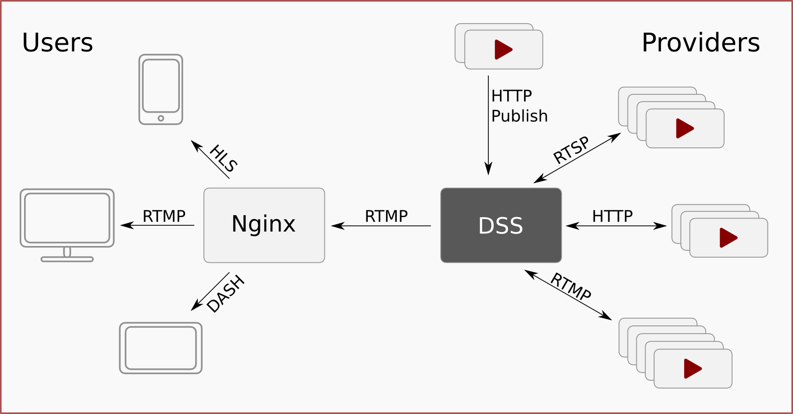

Dynamic Stream Server
====

* Version: 0.6
* Authors:
    * [João Bernardo Oliveira](https://github.com/jbvsmo/)
    * [Nelson Perez](https://github.com/bilthon/)
* Git: <https://github.com/terabit-software/dynamic-stream-server>
* Wiki: <https://github.com/terabit-software/dynamic-stream-server/wiki>
* License: [BSD](COPYRIGHT)
* Contact: <contato@terabit.com.br>

----

This software is being developed at the *Laboratório de Computação Paralela e Sistemas Móveis* ([Compasso](http://www.compasso.ufrj.br/)) - Federal University of Rio de Janeiro ([COPPE/UFRJ](http://www.coppe.ufrj.br/)).

----

*Dynamic Stream Server* (DSS) is a tool to manage video streams on a server using RTMP to unify them. After your streams are published on the RTMP server, they can be served over HTTP with [Apple HLS][7] or [MPEG-DASH][8] besides RTMP.

DSS uses [Nginx][2] and the [Nginx RTMP][3] module to provide reliable video streams over HTTP and RTMP and [FFmpeg][1] to provide transcoding capabilities. For metadata storage (like geotagging), [MongoDB][6] is needed.

DSS also provides a sytem to publish mobile streams using MPEG-TS over HTTP (generated currently only on Android devices).

Usage:

---- 

# Installation Guide:

1. ### [FFmpeg][1]:

    Compile or install FFmpeg latest version or from git master. Latest versions have
    much better RTMP support. Versions older than 1.0 may not work well (or not work at all).
    Libav **is not supported**.

    Requirements:
    - librtmp

    Optional (for best results):
    - libx264
    - libfdk_aac

2. ### [Nginx][2] with [Nginx-rtmp-module][3]:

    Download both projects and follow the instructions on README page of the latter.
    - Nginx 1.0 or newer (or whichever the other recommends).
    - Nginx-rtmp-module 0.9 or newer (older versions had a bug that did not tell when
      users stopped viewing the RTMP stream).

3. ### [MongoDB][5]:

    A MongoDB service must be running for some parts of the program to work.

4. ### Python 2.6+:

    This program will not work on Python versions older than 2.6. Do not try to use.

    For best results, use **Python 3.2** or newer. The multithreading support makes
    the program run much faster.

    Both CPython and PyPy are supported. Other Python interpreters are untested, but *may* work.

5. ### Running `setup.py`:

    This file will install several python modules.

    > If you do not want the modules installed globally, or you do not have *root* permissions,
    > create a [virtualenv][5] first.

    Run this command (as root if installing globally):

        $ python setup.py develop

    Replace `python` if you want another interpreter, e.g.: `python3`, `python3.3`, `pypy`

----

# Configuring:

1. Copy the content of `www` directory to the directory where you want to serve your files. You may also
set `nginx` to serve directly from this place to avoid the need to copy those files later when the project
is upgraded. See below.

2. Replace the Nginx configuration file `nginx.conf` installed with your system or add the missing
data from the `nginx.conf` provided with this project. Change the paths as needed.

3. Start `nginx` and verify that it is running.

4. If you pretend to change configurations from `dss/global.conf` (and you probably should), create a file
named `local.conf` in the same place and set only the variables you want to change. E.g, to set the base
directory to save files, add this to the file:

        [general]
        base_dir = /some/path/dynamic-stream-server

   To understand all options, read the [Configuration](../../wiki/Configuration) wiki page.

5. Add your stream providers (optional): If you want to pull streams from various sources, you'll need to add "Providers". Read the guide for [Provider Configuration](../../wiki/Providers).

----

# Running:

* With Nginx running, start the server. If you want to listen on TCP ports < 1024, run it as root.

        $ python server.py

   Replace `python` if you want another interpreter, e.g.: `python3`, `python3.3`, `pypy`

----

# Other:

- Windows Support:

    The project should also work on Windows and the Nginx-rtmp-module is known to compile as of [version 1.0.1][4].

    You may have to replace `exec_play` and `exec_play_done` to `on_play` and `on_play_done` respectively
    on `nginx.conf` and remove the call to `curl`.

    You should change all the paths on `local.conf` and `nginx.conf` to be compliant with Windows.

[1]: http://ffmpeg.org/
[2]: http://nginx.org/
[3]: http://github.com/arut/nginx-rtmp-module
[4]: http://rarut.wordpress.com/2013/06/13/windows-support-in-1-0-1/
[5]: http://www.virtualenv.org/en/latest/
[6]: http://www.mongodb.org/
[7]: http://en.wikipedia.org/wiki/HTTP_Live_Streaming
[8]: http://en.wikipedia.org/wiki/Dynamic_Adaptive_Streaming_over_HTTP

